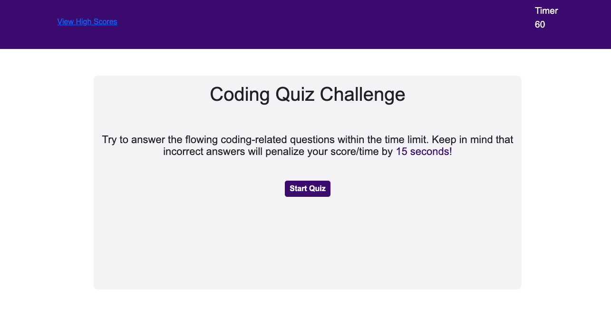

# Kowther's JavScript Quiz Application

This is a straightforward quiz application built using HTML, CSS, and JavaScript. It tests the user's JavaScript knowledge within a 60-second timeframe. Correct answers earn the user 1 point, while incorrect ones deduct 10 seconds from the remaining time. Additionally, the user can store their initials and score via localStorage, allowing them to view their high score after completing the quiz.

## Table of Contents

- User Story
- Acceptance Criteria
- Installation
- Usage
- Features
- Contributing
- Support
- Acknowledgements
- Authors
- Webpage Screenshot
- Deployed Application

## User Story

As a coding boot camp student, I want to engage in a timed quiz on JavaScript fundamentals and keep track of high scores to assess my progress among peers.

## Acceptance Criteria

- Starting the quiz begins a timer and presents a question.
- Answering a question leads to the next one.
- Incorrect answers deduct time from the clock.
- Upon completion or when the timer hits 0, the game ends.
- At the end, initials and scores can be saved.

## Installation

No specific installations are needed to access this project.

## Usage

This project is solely for educational purposes.

## Features

- Built using HTML, CSS, and JavaScript.

## Contributing

This project was solely created by Kowther Kahin, a UC Berkeley Bootcamp Student, without additional contributors.

## Support and Acknowledgements

No additional support or acknowledgements are present.

## Author

Created by Kowther Kahin, UC Berkeley Bootcamp Student

## Webpage Screenshot

## Deployed Application

Access the deployed application [here]( https://kowther7.github.io/JavaScriptQuiz/)